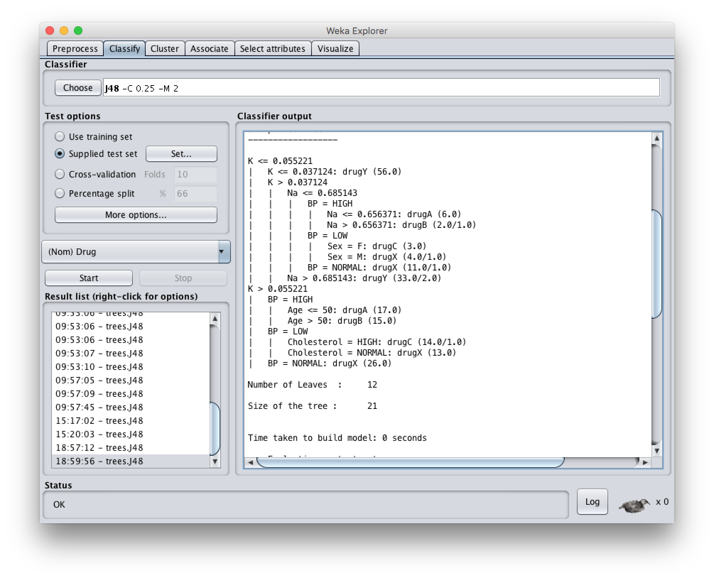

% Lab 9: Machine Learning
% Jorge García Ferreiro; Pedro García Castillo
% 25/April/2016

Exercise 1: J48
======================

**Objetive**
Executes J48: (Weka version of C4.5) with drug1n.arff. Once built the decision tree, I evaluate it using 3 different methods: "training set", "cross-validation" and "supplied test set" (using as drug2n.arff set of tests). Analyzes the results. Text is coming soon.

The first step we have taken is to load the training data file "drug1n.arff". That said, we open the Classify tab and choose the classifier "J48".

Then, once generated the decision tree C4.5 we discuss how the algorithm behaves according to the evaluation methods we are using ("training set", "cross-validation" and "supplied test set").

### Training set

<!--  -->

In this example we obtain a high percentage of success. Around 97%! That's huge and shows that our system is overfitted. Because we're training and testing with the same data.

| Date | Instances | Success |
|:----------------------------------|:---:|:----:|
| Correctly Classified Instances     | 194 | 97% |
| Incorrectly Classified Instances   |  6  |  3% |

So our system train and test with same data... So, obviously it will obtain a good score because they are almost the same (so our system was modeled according to this data).

### Cross-validation

<!--  -->

In this method we train and test with same data but dividing our data in different chunks. So the system will obtain the mediam of all the obtained result. In this case, the result is less than the Training set but is also overfitted.

| Date | Instances | Success |
|:----------------------------------|:---:|:----:|
| Correctly Classified Instances     | 185 | 92.5 % |
| Incorrectly Classified Instances   |  15  |  7.5% |

### Supplied test set

<!--  -->

In this case we feed our system with a custom data and then test with another different dataset. We obtain a great mark! 90.5% of accuracy! That's a very good result with a different dataset. This means that the algorithm made a good model.

Despite this mark is lower than the previous ones, is a very good result (taking into account the dataset is different)

| Date | Instances | Success |
|:----------------------------------|:---:|:----:|
| Correctly Classified Instances     | 362 | 90.5 % |
| Incorrectly Classified Instances   |  38  |  9.5% |

Exercise 1: ZeroR
======================

ZeroR is the simplest classification method which relies on the target and ignores all predictors. ZeroR classifier simply predicts the majority category (class). So this algorithm is not good, but is useful to compare with others algorithm

### Training set

<!--  -->

Really bad result. Just 45% of success. And 54 of failure. That means this algorithm is really bad and don't predict the correct data.

So the model it's creating is really bad. That's because it constructs a frequency table for the target and select its most frequent value.

| Date | Instances | Success |
|:----------------------------------|:---:|:----:|
| Correctly Classified Instances     | 91 | 45.5% |
| Incorrectly Classified Instances   |  109  |  54.4% |

### Cross-validation

<!--  -->

Also cross validation performs really bad. That's because the data is still the same. And the model has not changed. So we obtain the same results as with the training set (nothing changes).

| Date | Instances | Success |
|:----------------------------------|:---:|:----:|
| Correctly Classified Instances     | 91 | 45.5% |
| Incorrectly Classified Instances   |  109  |  54.4% |

### Supplied test set

<!--  -->

So in the supploed test set things get worse! And the accuracy now is lower than previous execution. This make sense, because when we use another data set in every type of program we normally obtain lower results (because sometimes is difficult to not overfitting our algorithm). In this case we got 3% worse than when cross validation.

| Date | Instances | Success |
|:----------------------------------|:---:|:----:|
| Correctly Classified Instances     | 170 | 42.5% |
| Incorrectly Classified Instances   |  230  |  57.5% |

Ejercicio 2
======================

**Enunciado**
Aplica clustering jerárquico sobre el mismo conjunto de datos y analiza los resultados obtenidos.

------------------
